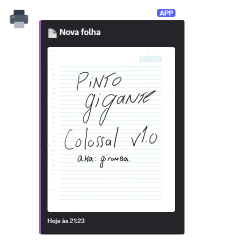

# Printer-cord
> Script simples que usa NAPS2 para se comunicar com o seu scanner e enviar uma cópia para o Discord.

### O que este script faz:

- Detecta o primeiro scanner disponível via NAPS2 CLI.
- Realiza o escaneamento em PNG.
- Envia o resultado como embed em um Webhook do Discord.

### Pré-requisitos

- Windows com [NAPS2 Console CLI](https://www.naps2.com/cli) instalado.
- Node.js (versão 14 ou superior).
- Dependências instaladas:

```bash
npm i
node .
```

